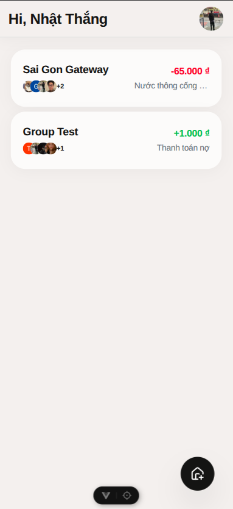
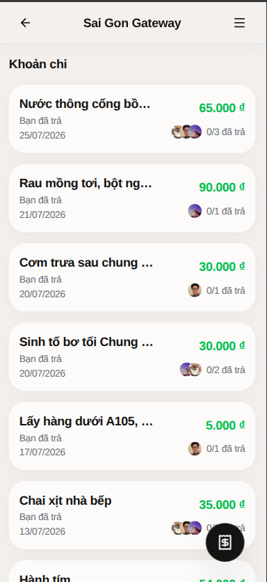
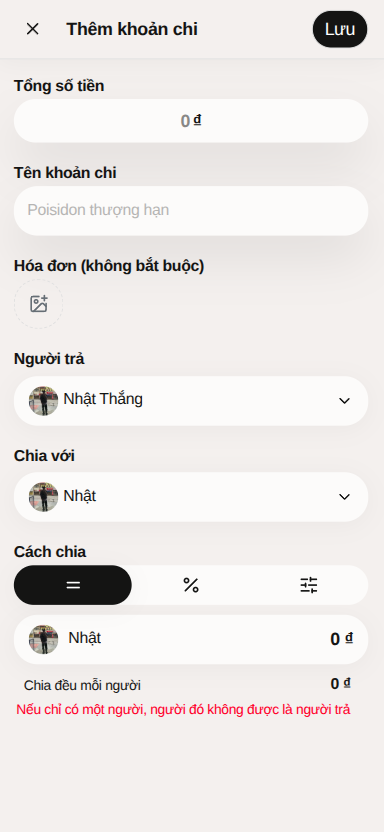
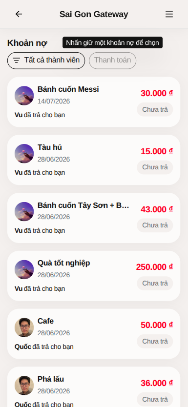
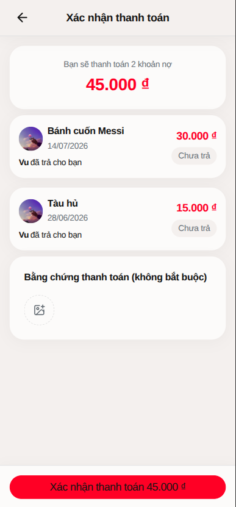
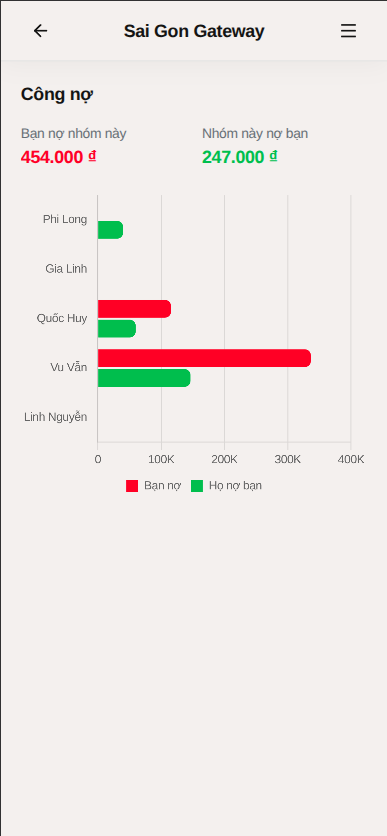
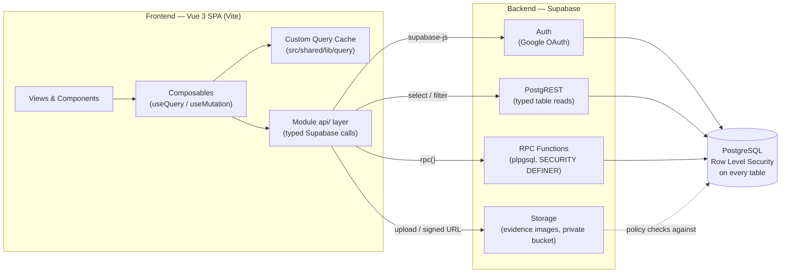
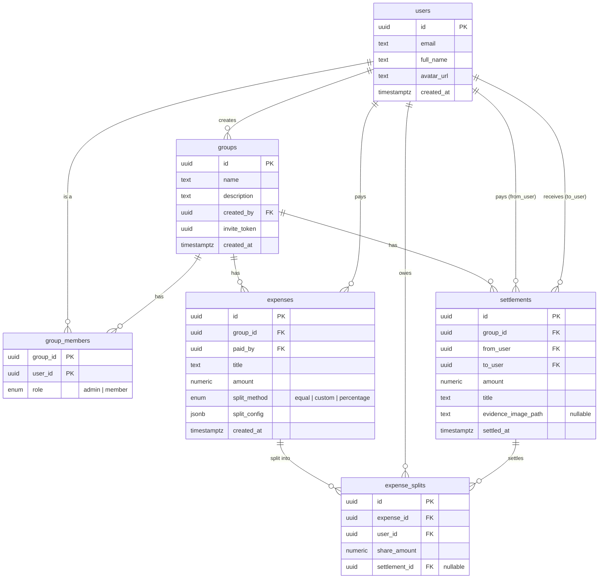

<div align="center">


# Payly

**A full-stack expense-sharing app that replaces the group spreadsheet.**

Built end-to-end — Vue frontend, Postgres/Supabase backend, and even the
pieces most projects reach for a library instead: a **self-built UI
component library** (no component-kit dependency) and a **custom-built
frontend data-caching layer**, on top of database-level security and atomic
multi-row transactions.

[](https://github.com/Nhatthang27/web-payly/actions/workflows/ci.yml)


<!--
  TODO: record a short demo GIF (screen capture of: sign in → create group →
  add an expense with a custom split → settle a debt) and drop it at
  docs/screenshots/demo.gif, then uncomment:

  
-->

**[Live Demo](https://lets-payly.vercel.app/)** &nbsp;·&nbsp; **[Setup & Development Guide](./SETUP.md)** &nbsp;·&nbsp; **[Architecture Docs](./.docs)**

<!-- TODO: replace `#` above with the deployed Vercel URL -->

</div>

---

## Table of Contents

- [Payly](#payly)
  - [Table of Contents](#table-of-contents)
  - [The Problem](#the-problem)
  - [The Approach](#the-approach)
  - [Key Features](#key-features)
  - [Screenshots](#screenshots)
  - [System Architecture](#system-architecture)
  - [Tech Stack](#tech-stack)
  - [Engineering Decisions](#engineering-decisions)
  - [Database Schema (ERD)](#database-schema-erd)
  - [API Overview](#api-overview)
  - [Getting Started](#getting-started)
  - [Roadmap](#roadmap)
  - [Author](#author)

---

## The Problem

Splitting shared costs in a group — a trip, an apartment, a recurring
dinner — usually degenerates into a spreadsheet or a thread of "wait, who
paid for what?" messages. Nobody has a single source of truth for who
fronted money, how it should be divided, what's already been paid back, and
what each person's running balance is across the whole group.

## The Approach

Payly gives every group a shared, always-consistent ledger:

- **Record an expense** — one person pays, the cost is split **equally, by
  percentage, or by custom amount** across chosen members.
- **See real balances instantly** — a member-balance view nets every
  expense and settlement in a group down to "who owes whom, how much."
- **Settle up** — mark debts paid in a batch, optionally attaching a
  proof-of-payment image.
- **Follow the activity** — a per-group feed and a personal dashboard
  surface the latest expenses, debts, and settlements without digging
  through history.
- **Edit safely** — updating an expense re-derives its entire split from
  scratch on the server (delete-all / recreate), and the database refuses
  to let you edit an expense that's already been partially settled, so the
  ledger can never drift out of sync with money that's already changed
  hands.

## Key Features

Organized by module (`src/modules/*`), mirroring how the codebase itself is split:

| Module             | Features                                                                                                                 |
| ------------------ | ------------------------------------------------------------------------------------------------------------------------ |
| **`auth`**         | Google OAuth sign-in via Supabase Auth; auth-guarded routes.                                                             |
| **`group`**        | Create groups, edit group info, join via shareable invite link/token.                                                    |
| **`group-member`** | List and manage members of a group.                                                                                      |
| **`expense`**      | Add/edit expenses; split **equal / percentage / custom**; per-expense breakdown of who owes what and who's already paid. |
| **`settlement`**   | Settle one or many debts in a single action; attach an evidence (proof-of-payment) image.                                |
| **`statistics`**   | Personal financial summary (total spent / owed / balance); per-group member-balance chart.                               |
| **`home`**         | Cross-group dashboard: recent activity feed, quick links into each group.                                                |

## Screenshots










## System Architecture



- **Frontend** never talks to Postgres directly — every request goes
  through `@supabase/supabase-js`, and that SDK is only imported once, in
  `shared/lib/supabase.ts` (enforced by convention — see
  [`.docs/CODEBASE_STRUCTURE.md`](./.docs/CODEBASE_STRUCTURE.md)).
- **Simple reads** (lists, detail pages) go straight through PostgREST as
  typed `select` queries.
- **Multi-row writes** (create/update an expense + its splits, settle a
  batch of debts) go through **Postgres RPC functions** instead of several
  dependent client calls, so they're atomic and validated server-side.
- **PostgreSQL** is the single source of truth for both data _and_ access
  control — every table has Row Level Security policies, so authorization
  holds even if a request bypasses the app.
- **Supabase Storage** holds settlement evidence images in a private
  bucket, gated by storage policies tied to group membership.

## Tech Stack

| Layer         | Choice                                                              |
| ------------- | ------------------------------------------------------------------- |
| Framework     | Vue 3 (`<script setup>`), Vue Router, Pinia                         |
| Language      | TypeScript, end-to-end                                              |
| Backend       | Supabase — Postgres, Auth, Storage, RLS, RPC (`plpgsql`)            |
| Styling       | Tailwind CSS v4                                                     |
| Forms         | vee-validate + Zod                                                  |
| Data fetching | Custom `useQuery` / `useMutation` cache layer (no external library) |
| Charts        | Chart.js / vue-chartjs                                              |
| Testing       | Vitest, Vue Test Utils                                              |
| Tooling       | Vite, ESLint + oxlint, Prettier, Husky + lint-staged                |
| CI            | GitHub Actions (lint, format, type-check, test on every PR)         |

## Engineering Decisions

**Supabase over a hand-rolled backend.** A solo project needs auth,
a relational database, row-level authorization, and file storage — Supabase
gives all four with a typed client generated straight from the schema. That
trade is deliberate: less time on boilerplate CRUD plumbing, more time on
the parts of the architecture that are actually interesting (the RPC/RLS
design, the caching layer).

**Postgres RPC functions as the write boundary, not client-side chaining.**
Creating an expense means writing to two tables (`expenses` and
`expense_splits`) that must succeed or fail together. Doing that as two
sequential client requests risks a half-written expense if the second call
fails. Wrapping it in a single `plpgsql` function makes it one transaction,
and — just as importantly — moves validation (group membership, duplicate
split recipients, non-negative shares) into the database, where it can't be
skipped by a client that forgot to check.

**A hand-built query cache instead of TanStack Query.** `src/shared/lib/query/`
is a small observer/subscriber cache (`QueryCache`, `QueryClient`,
`useQuery`, `useMutation`) with its own unit tests. Payly's data-fetching
needs are modest — this was a deliberate choice to actually build the
cache-invalidation/subscription model that libraries like TanStack Query
abstract away, rather than depend on one for a handful of query keys.

**Zod schemas driving vee-validate forms.** Form validation and the RPC's
expected input shape both derive from the same intent (e.g. "a share amount
must be non-negative"), so keeping validation in Zod schemas colocated with
each form — and inferring the form's TypeScript type from the schema —
keeps that single instead of duplicated between a form file and a type
file.

**Feature-first modules over technical layers.** Instead of global
`controllers/`, `services/`, `models/` folders, each domain
(`expense`, `settlement`, `group`, …) owns its own `api/ → composables/ →
views/` slice under `src/modules/`. Conventions are written down in
[`.docs/`](./.docs) rather than left implicit, so the structure survives
beyond one person's memory of why it's organized that way.

## Database Schema (ERD)



Notes:

- `expense_splits.settlement_id` is how a debt's status is derived — `NULL`
  means still owed, set means paid off by that settlement.
- Every table has Row Level Security enabled; access is always scoped
  through `group_members` (see the policies in
  [`supabase/migrations/20260712133736_remote_schema.sql`](./supabase/migrations/20260712133736_remote_schema.sql)).
- Schema changes are tracked as incremental files under
  [`supabase/migrations/`](./supabase/migrations) — that folder is the
  actual source of truth, this diagram is a snapshot of it.

## API Overview

Payly doesn't have a hand-written REST/GraphQL API layer — Supabase
generates one from the schema. The module `api/` files
(e.g. [`expense.api.ts`](./src/modules/expense/api/expense.api.ts)) wrap two
kinds of calls:

**Typed table reads** (via PostgREST, RLS-scoped automatically):

```ts
supabase
  .from('expenses')
  .select(
    `id, title, amount, paid_by,
  expense_splits ( user_id, share_amount, settlement_id )`,
  )
  .eq('group_id', groupId)
```

**RPC calls**, for anything that writes more than one row or needs a
server-computed aggregate:

| Function                     | Purpose                                                                                                                                     |
| ---------------------------- | ------------------------------------------------------------------------------------------------------------------------------------------- |
| `create_expense_with_splits` | Insert an expense and its splits atomically; validates membership, duplicate recipients, non-negative shares.                               |
| `update_expense_with_splits` | Replace an expense's splits (delete-all / recreate) after re-validating the same invariants; blocked if any split is already settled.       |
| `settle_expense_splits`      | Settle one or more debts in a batch, optionally attaching an evidence image; creates the `settlements` row(s) and links the splits to them. |
| `get_group_activities`       | Latest expense/debt/settlement event per group, for the home dashboard feed — computed in one query instead of N+1 client-side joins.       |
| `get_group_member_balances`  | Net balance (`they_owe_me` / `i_owe_them`) per member of a group.                                                                           |
| `get_user_financial_summary` | Total spent / owed / balance across all of a user's groups.                                                                                 |

Every RPC checks `auth.uid()` and group membership itself
(`SECURITY DEFINER` + explicit checks), so authorization doesn't depend on
the client calling it correctly.

## Getting Started

```sh
npm install
npm run dev
```

Full instructions — environment variables, linking a Supabase project,
running migrations, tests, and type generation — are in
**[SETUP.md](./SETUP.md)**.

## Roadmap

- [ ] **PWA support** — installable app + offline shell (in progress).
- [ ] Push/email notifications for new expenses and settlements.

## Author

Built by [Thang Nhat Tran](https://github.com/thang-nhat-tran).
